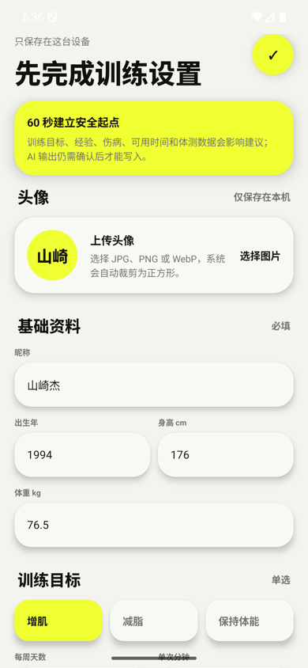
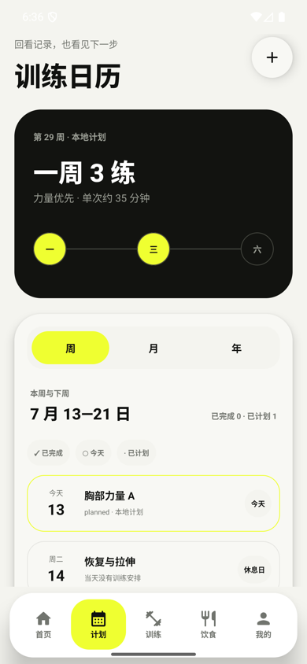
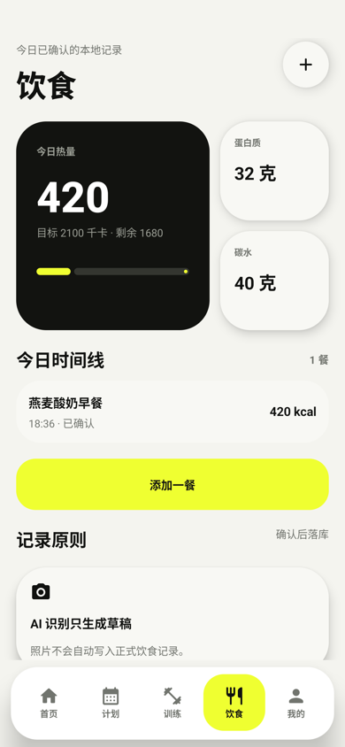
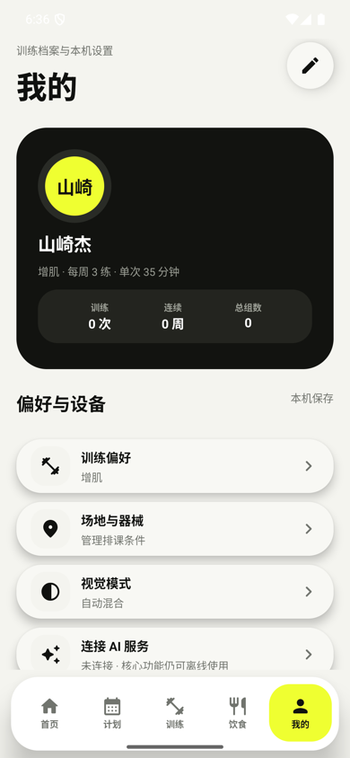
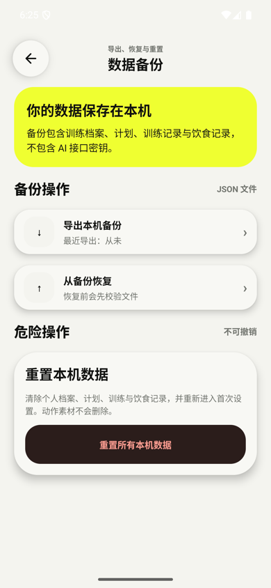

<p align="right">
  <strong>简体中文</strong> | <a href="./README.en.md">English</a>
</p>

# i fitness

一个本地优先的 Android 健身助手，用来管理训练场地、器械、训练计划、动作元数据、训练记录、饮食估算和 AI 建议。应用默认不需要账号、不依赖云同步，核心数据保存在本机 SQLite 中。

## 项目状态

- 原生 Compose MVP 已完成，主导航固定为 `首页 / 计划 / 训练 / 饮食 / 我的`。
- 主流程已跑通：制定计划、选择动作、训练执行、组间休息、训练总结、饮食记录、AI 设置和本地备份。
- 动作清单包含 1324 条元数据；正式构建默认排除第三方 GIF，只有提供授权凭证时才能显式启用。
- 已在 Pixel 8 Pro 模拟器完成真实数据验收：29/29 JVM 测试、61/61 设备测试通过，无崩溃或 ANR。

## 界面预览

以下截图来自 Pixel 8 Pro 模拟器中的真实原生 Android 应用，展示本地优先的首次设置、计划、饮食、个人档案和备份流程。

<table>
  <tr>
    <td align="center"></td>
    <td align="center"></td>
    <td align="center"></td>
  </tr>
  <tr>
    <td align="center">首次设置</td>
    <td align="center">训练日历</td>
    <td align="center">饮食记录</td>
  </tr>
  <tr>
    <td align="center"></td>
    <td align="center"></td>
    <td align="center"></td>
  </tr>
  <tr>
    <td align="center">个人档案</td>
    <td align="center">数据备份</td>
    <td align="center"></td>
  </tr>
</table>

## 当前开发需求

未来主义新拟态 UI、训练日历、可编辑体测、AI 全档案计划、三服务商配置与头像上传的开发基线见：

- [`i fitness 未来主义新拟态 UI 开发需求`](./docs/superpowers/specs/2026-07-11-futuristic-neumorphism-ui-development-requirements.md)

该文档区分了“浏览器原型已验证”与“原生 Android 待实现”，并提供数据迁移、代码影响范围、测试矩阵和完整验收清单。

## 功能

### 本地优先

- 本地 SQLite 保存场地、器械、动作库、计划、训练记录、饮食记录和 AI 草稿。
- 无账号、无默认云同步、无服务端数据依赖。
- 支持 JSON 备份导出和导入，方便迁移本地数据。

### 训练计划

- 按场地和器械生成训练计划。
- 支持周计划和月计划入口。
- 支持编辑计划、调整动作、跳过训练、复制训练和重新安排日期。
- 支持未完成训练恢复。

### 训练执行

- 记录组数、次数、重量和训练感受。
- 支持在已取得媒体授权的构建中查看动作 GIF，并提供休息计时、动作替换和跳过动作。
- 支持根据历史训练生成下一次训练调整建议。
- 训练中与训练总结使用沉浸式页面，不显示全局底部导航。

### 动作库

- 内置 1324 条 MIT 许可的动作元数据，实际 GIF 文件不提交到 Git。
- 动作媒体归 Gym Visual 所有，元数据的 MIT 许可不包含媒体使用权。
- 支持按胸、背、腿、核心等维度筛选。
- 支持动作搜索和动作详情查看。
- 动作库使用虚拟列表渲染，避免大量 GIF 一次性渲染造成卡顿。

### 饮食与 AI

- 支持拍照或文字描述生成热量估算草稿。
- AI 结果必须用户确认后才写入本地饮食记录。
- 支持兼容 OpenAI 的请求格式，当前默认 DeepSeek 配置入口。
- API 密钥使用 Android Keystore + AES/GCM 加密保存，不写入 SQLite。
- 用户主动发起 AI 功能时，输入的文字和选择的饮食图片可能传输给已配置的 AI 服务商。

## 技术栈

- Kotlin
- Jetpack Compose + Material 3
- 基于 `SQLiteOpenHelper` 的手写 SQLite
- Android Keystore 加密 AI 凭据
- Coil + GIF 解码器
- Kotlinx Serialization JSON
- JUnit, AndroidX Test, Compose UI Test
- Gradle Android Plugin 8.11.1

## 项目结构

```text
.
├── app/
│   └── src/
│       ├── main/
│       │   ├── assets/exercise-media/     # 包含 GIF 远程地址的动作清单
│       │   ├── java/com/shanqijie/fitnessapp/
│       │   │   ├── MainActivity.kt        # Android 入口，挂载原生 UI Root
│       │   │   ├── ai/                    # AI 请求客户端
│       │   │   ├── data/                  # SQLite、仓储、备份、凭据
│       │   │   ├── domain/                # 训练状态、汇总和本地规则
│       │   │   └── ui/                    # 五项导航、主题、组件与各业务页
│       │   └── res/
│       ├── test/                          # JVM 单元测试
│       └── androidTest/                   # 仪器测试
├── docs/superpowers/plans/                # 实现计划与验证记录
├── scripts/                               # 资源下载脚本
├── gradle/
├── build.gradle.kts
├── settings.gradle.kts
└── README.md
```

## 快速开始

### 环境要求

- Android Studio 或 Android SDK 命令行工具
- JDK 17
- Android SDK 36
- Android 8.0+ 设备或模拟器，应用 `minSdk = 26`

### 构建调试 APK

动作媒体不属于元数据的 MIT 授权范围。只有在你已经从权利人取得必要授权时，才可以使用下载脚本：

```bash
python3 scripts/download-exercise-gifs.py --i-have-media-license
```

只下载前 10 个资源进行快速检查：

```bash
python3 scripts/download-exercise-gifs.py --limit 10 --i-have-media-license
```

```bash
./gradlew :app:assembleDebug
```

APK 输出路径：

```text
app/build/outputs/apk/debug/app-debug.apk
```

### 安装到设备

```bash
adb install -r app/build/outputs/apk/debug/app-debug.apk
adb shell am start -n com.shanqijie.fitnessapp/.MainActivity
```

## 测试

| 验证面 | 结果 |
| :--- | :--- |
| JVM 单元测试 | 29/29 通过 |
| Pixel 8 Pro 设备/界面测试 | 61/61 通过 |
| Debug APK 与 AndroidTest APK | 构建通过 |
| 真实 SQLite 流程 | 训练、组记录、饮食记录已验证 |

运行 JVM 单元测试：

```bash
./gradlew :app:testDebugUnitTest
```

构建 Debug 和 AndroidTest APK：

```bash
./gradlew :app:assembleDebug :app:assembleDebugAndroidTest
```

运行连接设备测试：

```bash
./gradlew :app:connectedDebugAndroidTest
```

完整验证命令：

```bash
./gradlew :app:testDebugUnitTest :app:assembleDebug :app:assembleDebugAndroidTest :app:connectedDebugAndroidTest
```

## 数据与隐私

- 训练和饮食数据默认保存在本机。
- 备份文件由用户主动导出或导入。
- AI 生成内容以草稿形式保存，确认后才进入正式记录。
- API 密钥使用 Android Keystore 加密保存。
- 用户调用 AI 时，提示词和选择的饮食图片会按配置发送给第三方 AI 服务商，需同时遵守该服务商的条款和隐私政策。
- 项目没有默认账号体系、社交功能或云端同步。

## 资源说明

本项目不提交大体积 GIF 二进制文件。清单中的动作数据与动作媒体适用不同的权利边界：

- `datasetRecordsWithMedia`: 1324
- `exercise-gifs-pack-001`: 1324 个资源，全部下载后约 122.78 MB

资源清单位于：

```text
app/src/main/assets/exercise-media/manifest.json
```

下载脚本位于：

```text
scripts/download-exercise-gifs.py
```

- 动作元数据与结构：上游 MIT License。
- 动作图片与 GIF：© Gym visual，不在 MIT 许可范围内。

详细条款、归属和开源依赖见 [`THIRD_PARTY_NOTICES.md`](./THIRD_PARTY_NOTICES.md)。

## 法律与发布边界

- 当前仓库为公开源码仓库；不将第三方 GIF 二进制文件推送到 GitHub。
- `i fitness` 是开发期项目名；商业化或公开发布前需进行商标检索。
- 训练、饮食和 AI 建议仅供参考，不构成医疗诊断、治疗或个人化营养处方。
- 对外发布 APK 前，需完成隐私政策、媒体授权、依赖许可清单和图标来源档案。

## AI 配置

应用提供 DeepSeek 风格、兼容 OpenAI 的配置入口。没有 API 密钥时，相关 AI 流程会走本地兜底逻辑，确保离线场景仍可使用。

## 设计原则

- 首页聚焦今日训练和最重要的下一步动作。
- 场地、器械、计划编辑等复杂表单使用二级页面，避免主页面拥挤。
- 训练中优先展示当前动作、组数、重量、次数、感受和休息状态。
- 本地资源路径不直接展示给用户。

## 当前限制

- 这是个人使用场景优先的 MVP，不包含账号、云同步和社交功能。
- AI 建议仅作为辅助，不应替代专业医疗、营养或训练建议。
- 未提供媒体授权凭证时，正式构建不会打包或展示第三方 GIF；动作库仍可显示文字信息。

## 许可证

本项目代码以 [MIT License](./LICENSE) 发布；第三方数据、媒体和依赖的边界见 [THIRD_PARTY_NOTICES.md](./THIRD_PARTY_NOTICES.md) 与 [DEPENDENCY_NOTICES.md](./DEPENDENCY_NOTICES.md)。隐私说明见 [PRIVACY_POLICY.md](./PRIVACY_POLICY.md)。
